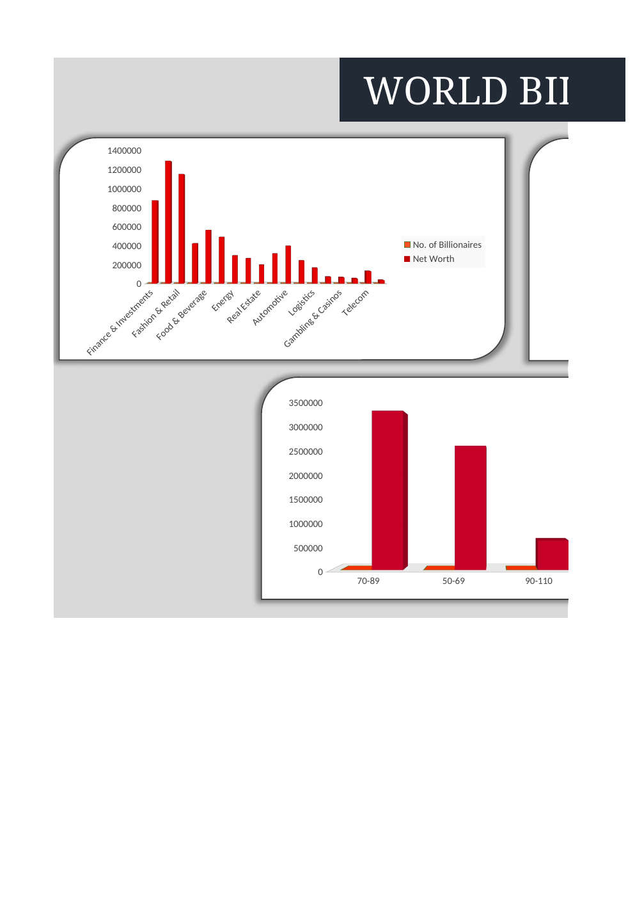
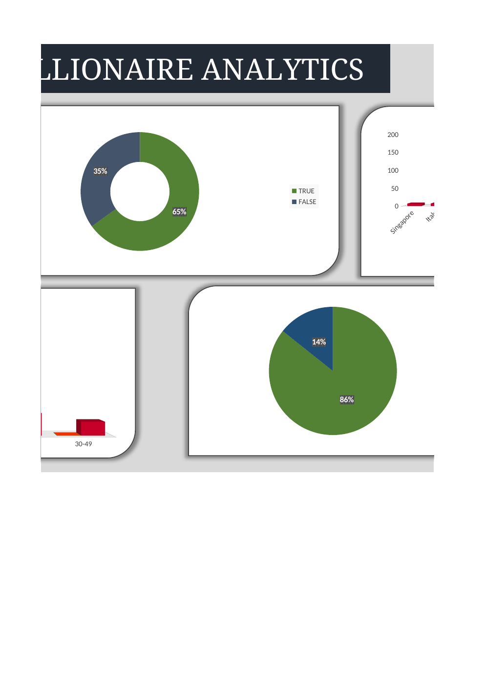
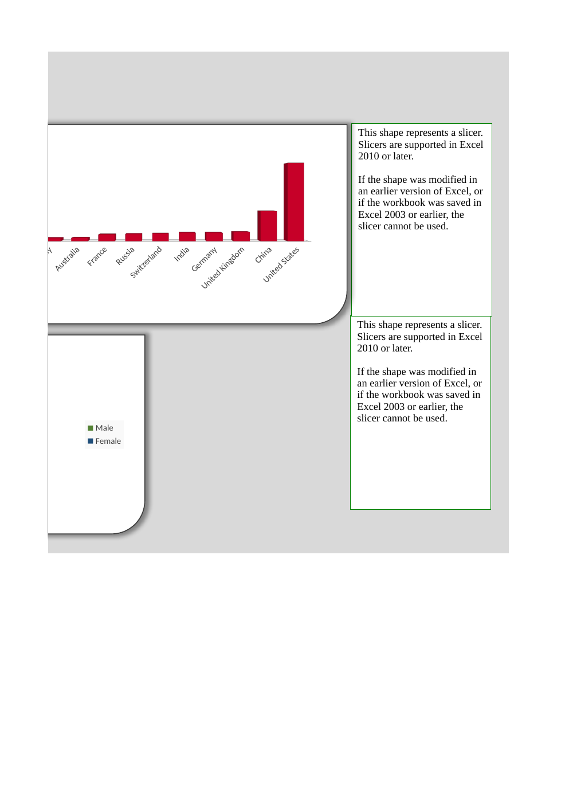

# 💰 World Billionaires Analysis — Excel

An interactive Excel analysis of a billionaire dataset, covering wealth, industries, countries, age groups, gender, and self-made status.

## 📌 Project Overview

This project uses Microsoft Excel to clean, organize, summarize, and visualize a dataset containing **475 billionaire records**.

The workbook combines data preparation, formula-based analysis, PivotTables, a summary sheet, and an interactive dashboard to explore patterns across billionaire demographics, industries, geography, and net worth.

## 🗂️ Workbook Structure

The workbook contains seven sheets:

- **Raw Data** — original dataset
- **Cleaned Data** — prepared analysis table with 475 records
- **Summary Sheet** — global statistics and a billionaire profile card
- **Pivot Tables** — category, country, gender, self-made, and age-group summaries
- **Dashboard** — visual analysis of the dataset
- **Insights** — reserved for analytical observations
- **Recommendations** — reserved for recommendations

## 📊 Key Metrics in the Workbook

| Metric | Value |
|---|---:|
| Billionaire records | 475 |
| Total wealth | 7,040,400 |
| Average age | 70.63 years |
| Highest net worth | 211,000 |
| Male billionaires | 407 |
| Female billionaires | 68 |
| Self-made | 309 |
| Not self-made | 166 |

> Net-worth values are reported in the units used by the source workbook.

## 🔍 Analysis Areas

### Industry & Category

The PivotTables summarize billionaire counts and total net worth across industries. Categories represented include Finance & Investments, Technology, Fashion & Retail, Manufacturing, Food & Beverage, Diversified, Energy, Healthcare, Real Estate, Metals & Mining, Automotive, Media & Entertainment, and others.

### Geography

The workbook analyzes billionaire distribution by country. The PivotTables include countries such as the United States, China, United Kingdom, Germany, India, Switzerland, Russia, France, Australia, Italy, and Singapore.

### Demographics

The analysis includes:

- Gender distribution
- Age-group distribution
- Self-made status
- Individual billionaire profile information

### Individual Profile Analysis

The Summary Sheet contains a profile-card section showing fields such as rank, category, country, source, gender, and net worth for a selected billionaire.

## 📈 Dashboard Snapshot

### Industry & Wealth Analysis



### Demographic Analysis



### Geographic Analysis



## 🛠️ Excel Skills Demonstrated

- Data cleaning and preparation
- Excel formulas
- `DATEDIF`-based age calculation
- Lookup-based analysis
- PivotTables
- Pivot-based summaries
- Conditional formatting
- Data validation
- Slicers / interactive filtering
- Dashboard development
- KPI summary design
- Charts and data visualization

## 🎯 Business Questions Explored

- How is billionaire wealth distributed across industries?
- Which industries contain the largest number of billionaires?
- How is billionaire wealth distributed geographically?
- What does the gender distribution look like?
- What proportion of billionaires are self-made?
- How are billionaires distributed across age groups?
- What are the characteristics of an individual billionaire selected through the profile card?

## 📁 Project Structure

```text
world-billionaires-analysis/
├── README.md
└── images/
    ├── dashboard-152.png
    ├── dashboard-153.png
    └── dashboard-154.png
```

The original Excel workbook can be provided separately if the dataset's redistribution terms permit public sharing.

## 🎓 Skills Demonstrated

This project demonstrates practical Excel-based data analysis, from raw-data preparation and formula work through PivotTable analysis and interactive dashboard presentation.

**Tools:** Microsoft Excel | PivotTables | Excel formulas | Data Visualization
